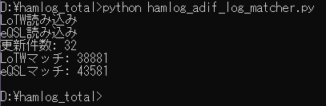

# DX Log Matcher for HAMLOG

Tool for automatically matching amateur radio QSO logs between **HAMLOG CSV** and **ADIF logs (LoTW / eQSL)**.

Designed for DXers who manage large HAMLOG databases and need fast, reliable confirmation verification.

---

## Overview

Amateur radio operators often maintain logs in **HAMLOG**, while confirmations are received later via **LoTW** or **eQSL**.

Because confirmations may be uploaded hours, days, or even years after the original QSO, manual matching becomes increasingly time-consuming and error-prone.

This tool automates the comparison process by applying flexible matching logic across multiple parameters.

### Background

HAMLOG traditionally used a simple QSL flag system, where the third character was often just "Y".

After incorporating confirmations from LoTW and eQSL, more granular classification became necessary. However, a large number of existing QSOs remained unverified, making manual processing impractical.

This script was developed to automate and standardize the matching process between HAMLOG logs and ADIF logs, enabling efficient handling of large-scale QSO datasets.

---

## Features

* Match **HAMLOG CSV logs** with **ADIF logs**
* Detect QSO matches using:

  * CALLSIGN
  * BAND
  * MODE
  * Time tolerance (default: ±60 minutes)
* Supports confirmation sources:

  * LoTW
  * eQSL
* Optimized for **DX confirmation workflows**
* High-speed processing for large log datasets

---

## Design Philosophy

This tool is designed with real-world log variability in mind.

Amateur radio logs often contain inconsistencies such as:

* Time offsets
* Mode differences (e.g., FT8 vs MFSK)
* Minor formatting variations

Instead of assuming perfectly aligned data, this script applies tolerant and practical matching rules to handle such discrepancies.

---

## Customization

This script is intentionally designed to be **modifiable**.

Different operators may have different logging environments, operating styles, or matching requirements. Therefore:

* You are encouraged to modify the script to suit your needs
* Key parameters such as:

  * Time tolerance
  * Mode normalization
  * Matching conditions
    can be freely adjusted

This is not a fixed or closed tool — it is a flexible matching engine intended to adapt to individual workflows.

---

## Requirements

* Python 3.x

No external libraries are required.

---

## Supported File Formats

### Input

* HAMLOG export file (CSV)
* LoTW log file (ADIF)
* eQSL log file (ADIF)

---

## Usage

1. Place the following files in the same directory:

```
hamlog.csv
lotw.adi
eqsl.adi
hamlog_adif_log_matcher.py
```

2. Run the script:

```
python hamlog_adif_log_matcher.py
```

3. The script will analyze the logs and detect matching QSOs.

---

## Matching Rules

Matches are determined using:

* CALLSIGN
* BAND
* MODE
* QSO time within a configurable tolerance (default: ±60 minutes)

These rules are designed to accommodate real-world logging delays and variations.

---

## Output

The script generates output files such as:

```
changes_checked.txt
hamlog_checked.csv
```

These files contain detected matches and verification results.

---

## Disclaimer

This software is provided **"as is"**, without warranty of any kind.

Use at your own risk.

---

## Author

Amateur radio operator developing tools for DX log verification.

---

## Notes

Sample files are included in the repository for testing.

This tool has been tested on a real HAMLOG database containing over **86,000 QSO records**, demonstrating fast and practical verification of LoTW and eQSL confirmations.
